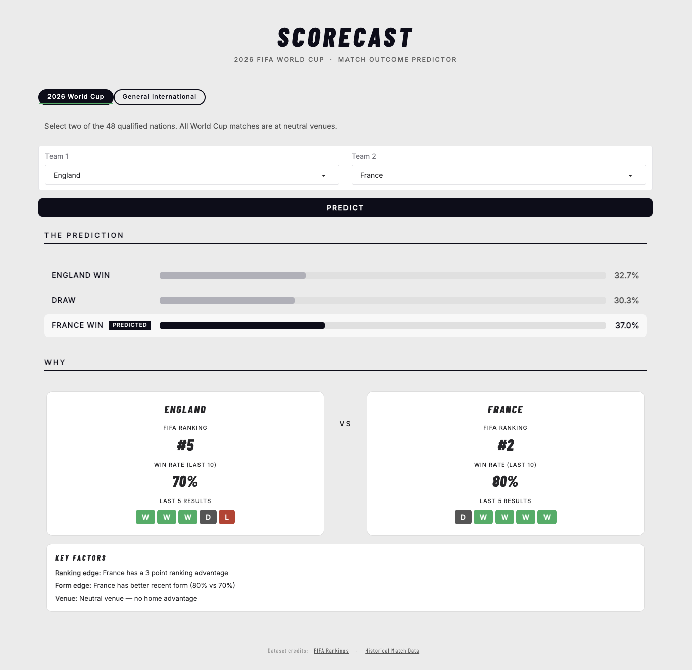

# Scorecast

A machine learning web app that predicts international soccer match outcomes — built around the 2026 FIFA World Cup.



## How it works

Rather than predicting win/draw/loss directly, Scorecast models the **expected goals** each team will score using two separate Poisson regression models — one for the home side, one for the away side. It then constructs an 11x11 score probability grid and derives win, draw, and loss probabilities by summing the appropriate triangles of that grid.

This approach is more expressive than a direct 3-class classifier because it captures the full distribution of possible scorelines, not just the most likely outcome.

## Feature engineering

Each prediction is built from the following features, all computed using only information available before the match to prevent data leakage.

**Elo ratings**
- `elo_home`, `elo_away`, `elo_diff` — each team's Elo rating, updated after every match using a K-factor that varies by competition type (60 for World Cup finals, 40 for qualifiers and continental tournaments, 20 for friendlies). Goal-difference multipliers follow the eloratings.net convention.

**Recent form and goal averages**
- `form_home`, `form_away` — recency-weighted points per game over the last 10 matches, scaled 0–1. More recent matches carry higher weight via exponential decay (factor 0.85 per match).
- `gf_home`, `ga_home`, `gf_away`, `ga_away` — recency-weighted goals scored and conceded per game over the same window.

**Head-to-head history**
- `h2h_home` — the home team's historical points share in all prior meetings between these two teams (0–1, defaults to 0.5 with no prior history).

**Match context**
- `neutral` — 1 if played at a neutral venue (all World Cup matches are neutral), 0 otherwise. Home advantage is built into the Elo calculation as a 60-point bonus.
- `is_competitive` — 1 for World Cup, qualifiers, and continental tournaments; 0 for friendlies.

## Training

Team state (Elo, form, goals) is built chronologically by replaying all matches from 1990 onward. Each match's feature vector is constructed from the state as it existed before that match, then updated after. This strict chronological ordering ensures no future information leaks into the training data.

## Features

- **2026 World Cup tab** — all 48 qualified nations, neutral venue
- **General International tab** — any two teams from the full historical dataset, with a home/neutral/away venue selector that updates dynamically with the selected team names
- Probability bar chart with the predicted outcome highlighted
- Team stats card showing FIFA ranking, win rate, and last 5 results per team
- Key factors summary covering ranking edge, form edge, and venue context

## Tech stack

Python · scikit-learn · scipy · pandas · NumPy · Gradio

**Datasets**
- [International Football Results (Kaggle)](https://www.kaggle.com/datasets/martj42/international-football-results-from-1872-to-2017)
- [FIFA World Rankings (Kaggle)](https://www.kaggle.com/datasets/caspersolheim/fifa-world-rankings)

## Run locally

```bash
git clone https://github.com/pitzilscript/scorecast-app.git
cd scorecast-app
python3 -m venv venv && source venv/bin/activate
pip install -r requirements.txt
python3 app.py
```

Then open `http://localhost:7860` in your browser.
